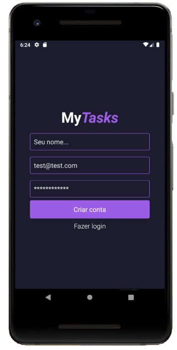
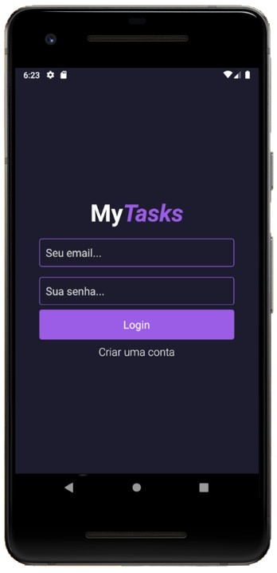
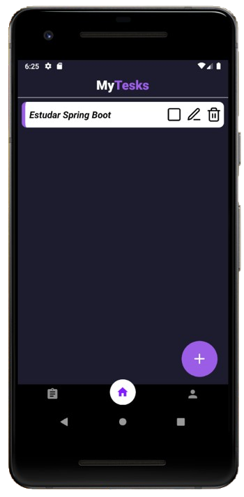
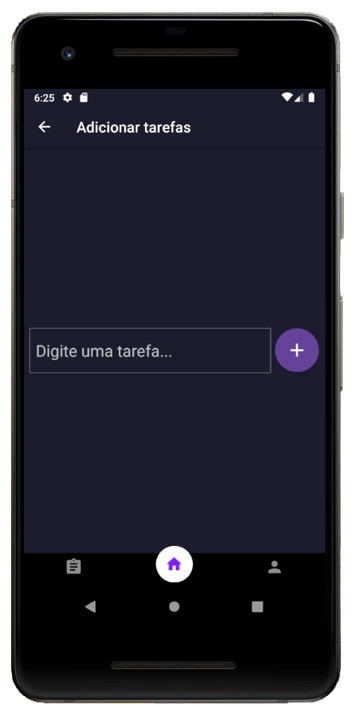
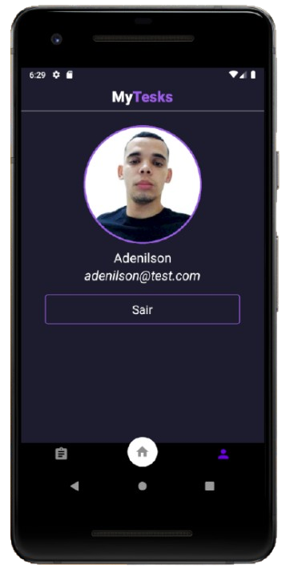
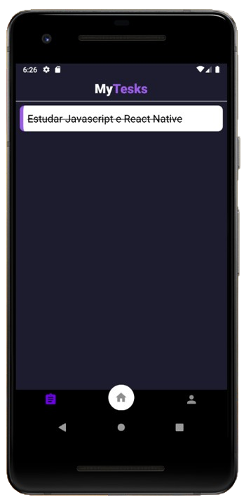

# 📱 MyTasks - Aplicativo de Gerenciamento de Tarefas


## 🧠 Objetivo do Projeto

O **MyTasks** é um aplicativo mobile desenvolvido em React Native que permite aos usuários gerenciar suas tarefas diárias de forma eficiente e intuitiva. O app oferece um sistema completo de autenticação, criação, edição, exclusão e acompanhamento de tarefas, com sincronização em tempo real através do Firebase.

### ✨ Principais Características

- 🔐 **Sistema de Autenticação Completo**: Login e registro com Firebase Authentication
- 📝 **Gerenciamento de Tarefas**: Criar, editar, excluir e marcar tarefas como concluídas
- 💾 **Persistência de Dados**: Armazenamento local com AsyncStorage e sincronização com Firestore
- 🎨 **Interface Moderna**: Design responsivo com tema escuro e elementos visuais atrativos
- 📱 **Navegação Intuitiva**: Sistema de navegação por abas para fácil acesso às funcionalidades
- 🔄 **Sincronização em Tempo Real**: Dados sincronizados automaticamente com o Firebase

## 🛠️ Tecnologias Utilizadas

<div align="center">
  <h3>🚀 Stack Tecnológica</h3>
</div>

### 📱 **Frontend & Mobile**
| Tecnologia | Versão | Descrição |
|------------|--------|-----------|
|  | 0.80.1 | Framework mobile multiplataforma |
|  | 19.1.0 | Biblioteca JavaScript para UI |

### 🔥 **Backend & Banco de Dados**
| Tecnologia | Versão | Descrição |
|------------|--------|-----------|
|  | 22.4.0 | Autenticação de usuários |
|  | 22.4.0 | Banco de dados NoSQL em tempo real |
|  | 22.4.0 | Armazenamento de arquivos |

### 🧭 **Navegação**
| Tecnologia | Versão | Descrição |
|------------|--------|-----------|
|  | 7.1.14 | Sistema de navegação principal |
|  | 7.3.21 | Navegação em pilha |
|  | 7.4.2 | Navegação por abas |

### 💾 **Armazenamento Local**
| Tecnologia | Versão | Descrição |
|------------|--------|-----------|
|  | 1.24.0 | Armazenamento local persistente |

### 🎨 **UI/UX & Ícones**
| Tecnologia | Versão | Descrição |
|------------|--------|-----------|
|  | 10.2.0 | Ícones vetoriais |
|  | 5.5.2 | Área segura para dispositivos |

### 🛠️ **Ferramentas de Desenvolvimento**
| Tecnologia | Versão | Descrição |
|------------|--------|-----------|
|  | 9.31.0 | Linting de código JavaScript |
|  | 2.8.8 | Formatação automática de código |
|  | 16.21.1 | Linting de estilos CSS |
|  | 29.6.3 | Framework de testes |

---

<div align="center">
  <h4>🎯 Arquitetura do Projeto</h4>
  <p><em>React Native + Firebase + AsyncStorage + React Navigation</em></p>
</div>

## 🏗️ Arquitetura do Projeto

```
src/
├── components/          # Componentes reutilizáveis
│   ├── Header/         # Cabeçalho do app
│   ├── ListTasks/      # Lista de tarefas ativas
│   └── finishedList/   # Lista de tarefas concluídas
├── contexts/           # Contextos React (Auth e Tasks)
├── pages/              # Telas principais do app
│   ├── LogIn/          # Tela de login/registro
│   ├── Home/           # Tela principal com tarefas
│   ├── NewTask/        # Criação/edição de tarefas
│   ├── FinishedTasks/  # Tarefas concluídas
│   └── Profile/        # Perfil do usuário
├── routes/             # Configuração de navegação
└── imgs/               # Imagens e assets
```

## 🔐 Sistema de Autenticação

O MyTasks utiliza o Firebase Authentication para autenticar usuários com e-mail e senha. O controle da sessão é feito com `AsyncStorage` para manter o usuário logado mesmo ao fechar o app.

### 📋 Como funciona:

1. O usuário se registra informando nome, e-mail e senha.
2. Os dados são autenticados pelo Firebase.
3. O perfil do usuário é salvo no Firestore.
4. A sessão é armazenada localmente com `AsyncStorage`.
5. Ao abrir o app novamente, o estado do usuário é verificado:
   - Se houver uma sessão ativa, o usuário vai direto para a tela principal.
   - Caso contrário, é redirecionado para a tela de login.
6. O logout limpa os dados locais e encerra a sessão no Firebase.

O estado da autenticação é gerenciado pelo `AuthContext`, que disponibiliza as funções de login, registro e logout para todo o app.

## 📱 Funcionalidades do App

### 🔐 Autenticação
- ✅ **Criar conta** com nome, email e senha
- ✅ **Login** com email e senha
- ✅ **Persistência de sessão** automática
- ✅ **Logout** com limpeza completa de dados

### 📝 Gerenciamento de Tarefas
- ✅ **Criar tarefas** com título e autor
- ✅ **Editar tarefas** existentes
- ✅ **Excluir tarefas** permanentemente
- ✅ **Marcar como concluída** (move para lista de finalizadas)
- ✅ **Visualizar tarefas concluídas** em aba separada

### 🎯 Funcionalidades Avançadas
- ✅ **Sincronização em tempo real** com Firebase Firestore
- ✅ **Ordenação por data** (mais recentes primeiro)
- ✅ **Limite de 50 tarefas** por consulta para performance
- ✅ **Interface responsiva** com tema escuro
- ✅ **Navegação intuitiva** por abas

## 🎨 Design da Interface

### 🎨 Paleta de Cores
- **Fundo Principal**: `#1A1A2E` (Azul escuro)
- **Cor de Destaque**: `#9B5DE5` (Roxo)
- **Texto**: `#FFFFFF` (Branco)
- **Bordas**: `#dcdcdc` (Cinza claro)

### 📱 Screenshots das Telas

#### 🔐 Tela de Login/Registro


**Características:**
- Design minimalista com logo "MyTasks" (roxo e branco)
- Campos de entrada: nome, email (test@test.com) e senha (************)
- Botão roxo "Criar conta" com texto branco
- Link "Fazer login" para alternar entre telas
- Interface limpa e intuitiva com tema escuro

#### 🔐 Tela de Login


**Características:**
- Logo "MyTasks" centralizado (roxo e branco)
- Campos de entrada: email e senha com placeholders
- Botão roxo "Login" com texto branco
- Link "Criar uma conta" para alternar para registro
- Design consistente com tema escuro

#### 🏠 Tela Principal (Home)


**Características:**
- Header com logo "MyTasks" em fundo roxo escuro
- Lista de tarefas com cards brancos
- Ícones de ação: quadrado (concluir), lápis (editar), lixeira (excluir)
- Botão flutuante roxo com ícone "+" no canto inferior direito
- Navegação por abas: lista, home (ativo), perfil

#### ➕ Tela de Nova Tarefa


**Características:**
- Header "Adicionar tarefas" com botão voltar
- Campo de texto centralizado com placeholder "Digite uma tarefa..."
- Botão circular roxo com ícone "+" para adicionar
- Navegação por abas na parte inferior
- Interface focada na criação de tarefas

#### 👤 Tela de Perfil


**Características:**
- Header "MyTesks" com separador branco
- Avatar circular do usuário com borda roxa
- Informações pessoais do usuário em texto branco
- Botão "Sair" com borda roxa e fundo escuro
- Navegação por abas com perfil ativo (ícone roxo)

#### ✅ Tela de Tarefas Concluídas


**Características:**
- Lista de tarefas com texto riscado
- Indicador visual de conclusão
- Ordenação por data de finalização
- Histórico de atividades
- Interface consistente com o tema escuro

### 📱 Fluxo de Navegação Visual

<div align="center">
  <p><em>Fluxo de navegação: Login → Home → Nova Tarefa → Editar Tarefa → Tarefas Concluídas → Perfil</em></p>
</div>

## 🚀 Como Executar o Projeto

### 📋 Pré-requisitos
- Node.js >= 18
- React Native CLI
- Android Studio (para Android)
- Xcode (para iOS - apenas macOS)
- Conta no Firebase

### 🔧 Configuração do Firebase

1. **Criar projeto no Firebase Console**
   - Acesse [console.firebase.google.com](https://console.firebase.google.com)
   - Crie um novo projeto
   - Ative Authentication com Email/Senha
   - Configure Firestore Database

2. **Configurar aplicativo Android/iOS**
   - Adicione aplicativo Android/iOS no projeto Firebase
   - Baixe o arquivo `google-services.json` (Android) ou `GoogleService-Info.plist` (iOS)
   - Coloque na pasta `android/app/` ou `ios/`

### 📦 Instalação e Execução

```bash
# 1. Clonar o repositório
git clone https://github.com/Adenilson-Silva-Dev/todolist.git
cd todoList

# 2. Instalar dependências
npm install
# ou
yarn install

# 3. Configurar Firebase (se necessário)
# Adicionar google-services.json na pasta android/app/

# 4. Executar o projeto
# Para Android
npm run android
# ou
npx react-native run-android

# Para iOS (apenas macOS)
npm run ios
# ou
npx react-native run-ios

# 5. Iniciar Metro Bundler (se não iniciar automaticamente)
npm start
# ou
npx react-native start
```

### 🔧 Scripts Disponíveis

```json
{
  "android": "react-native run-android",
  "ios": "react-native run-ios",
  "start": "react-native start",
  "lint": "eslint .",
  "test": "jest"
}
```
## 🔄 Fluxo de Navegação

```
App.js
├── AuthProvider (Context)
├── TaskProvider (Context)
└── NavigationContainer
    └── Routes
        ├── AuthRoutes (se não logado)
        │   └── LogIn
        └── AppRoutes (se logado)
            ├── Tab Navigator
            │   ├── FinishedTasks
            │   ├── StackHome
            │   │   ├── Home
            │   │   └── NewTask
            │   └── Profile
```


## 📝 Contribuição

1. Faça um fork do projeto
2. Crie uma branch para sua feature (`git checkout -b feature/AmazingFeature`)
3. Commit suas mudanças (`git commit -m 'Add some AmazingFeature'`)
4. Push para a branch (`git push origin feature/AmazingFeature`)
5. Abra um Pull Request


## 👨‍💻 Autor

**Adenilson Silva**
- GitHub: [@Adenilson-Silva-Dev](https://github.com/Adenilson-Silva-Dev)
- LinkedIn: [Adenilson Rosa](https://www.linkedin.com/in/adenilson-rosa-88702125a/)


<div align="center">
  <p>Feito com ❤️ e ☕</p>
</div>
